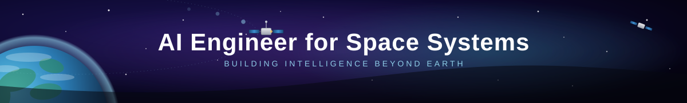

  

## Hello :)

I'm a Computer Engineering student aspiring to become an AI Engineer for Space Systems.

- 🔭 Working on satellite telemetry analysis and anomaly detection.
- 🌱 Learning AI/ML and intelligent space systems.
- 🚀 Interested in applying AI to real-world aerospace problems.

---

## 🛠️ Tech Stack

`Python` `Machine Learning` `TensorFlow` `Scikit-learn`
`NumPy` `Pandas` `Matplotlib` `Git` `GitHub`

---

## 🚀 Featured Projects

### 🛰️ Satellite Telemetry Analyzer

A Python-based system for satellite telemetry monitoring, anomaly detection, health assessment, mission reporting, and data visualization.

### 🤖 AI Satellite Anomaly Detection

AI-powered satellite telemetry anomaly detection using Random Forest and physics-based safety rules.

---

## 🌐 Connect With Me

  
  

